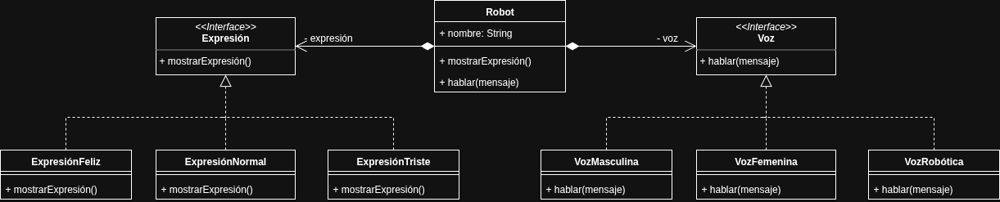

# Patrón Strategy - Robot configurable

Este ejemplo aplica el patrón **Strategy** a un robot que puede cambiar su voz y expresión dinámicamente.  
El robot utiliza las interfaces `Voz` y `Expresion` para definir sus comportamientos, permitiendo intercambiar distintas implementaciones sin modificar su código principal.

**Ventajas:**
- Permite cambiar comportamientos en tiempo de ejecución.  
- Evita estructuras condicionales.  
- Facilita la extensión y mantenimiento del código.

**Desventajas:**
- Aumenta la cantidad de clases.  
- Puede ser innecesario en proyectos pequeños.

